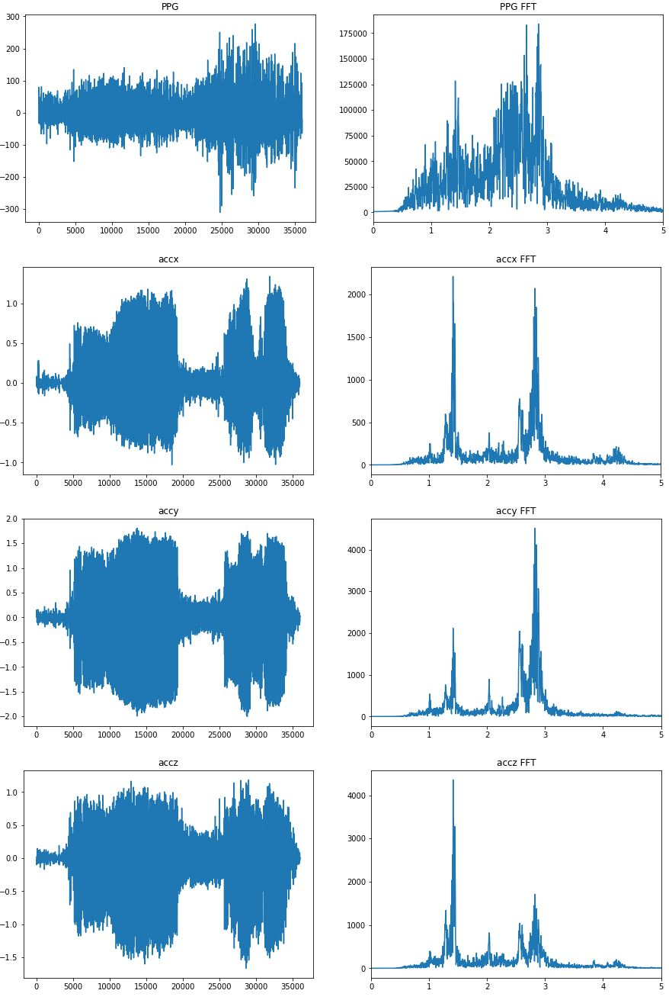

# PhysiologicalSignalsAI-Udacity
This is the forth project in fulfilment of the **AI for Healthcare** *Udacity Nanodegree*. The goal of this project is to develop an algorithm that estimate the pulse rate by reading PPG and accelerometer signals. The following Background is adopted from [*Udacity* project repository](https://github.com/udacity/nd320-c4-wearable-data-project-starter).

## Background
The following description of PPG principal is taken from [here](https://github.com/udacity/nd320-c4-wearable-data-project-starter#physiological-mechanics-of-pulse-rate-estimation).

Pulse rate is typically estimated by using the PPG sensor. When the ventricles contract, the capilaries in the wrist fill with blood. The (typically green) light emitted by the PPG sensor is absorbed by red blood cells in these capilaries and the photodetector will see the drop in reflected light. When the blood returns to the heart, fewer red blood cells in the wrist absorb the light and the photodetector sees an increase in reflected light. The period of this oscillating waveform is the pulse rate.
However, the heart beating is not the only phenomenon that modulates the PPG signal. Blood in the wrist is fluid, and arm movement will cause the blood to move correspondingly. During exercise, like walking or running, we see another periodic signal in the PPG due to this arm motion. Our pulse rate estimator has to be careful not to confuse this periodic signal with the pulse rate.
We can use the accelerometer signal of our wearable device to help us keep track of which periodic signal is caused by motion. Because the accelerometer is only sensing arm motion, any periodic signal in the accelerometer is likely not due to the heart beating, and only due to the arm motion. If our pulse rate estimator is picking a frequency that's strong in the accelerometer, it may be making a mistake.
All estimators will have some amount of error. How much error is tolerable depends on the application. If we were using these pulse rate estimates to compute long term trends over months, then we may be more robust to higher error variance. However, if we wanted to give information back to the user about a specific workout or night of sleep, we would require a much lower error.

<figure>
  

  

  <figcaption>
PPG signal & Blood Flow 
</figcaption>
</figure>

## Dataset
The first part of the project uses [Cardiac Arrythmia Suppression Trial (CAST)](https://physionet.org/content/crisdb/1.0.0/) dataset which was sponsored by the National Heart, Lung, and Blood Institute (NHLBI). CAST collected 24 hours of heart rate data from ECGs from people who have had a myocardial infarction (MI) within the past two years \[1\]. This data has been smoothed and resampled to more closely resemble PPG-derived pulse rate data from a wrist wearable \[2\].

1. Stein PK, Domitrovich PP, Kleiger RE, Schechtman KB, Rottman JN. Clinical and demographic determinants of heart rate variability in patients post myocardial infarction: insights from the Cardiac Arrhythmia Suppression Trial (CAST). Clin Cardiol 23(3):187-94; 2000 (Mar)
2. Goldberger, A., Amaral, L., Glass, L., Hausdorff, J., Ivanov, P. C., Mark, R., ... & Stanley, H. E. (2000). PhysioBank, PhysioToolkit, and PhysioNet: Components of a new research resource for complex physiologic signals. Circulation [Online]. 101 (23), pp. e215–e220.

The second part of the project uses **Troika** dataset from the following reference:
* Zhilin Zhang, Zhouyue Pi, Benyuan Liu, ‘‘TROIKA: A General Framework for Heart Rate Monitoring Using Wrist-Type Photoplethysmographic Signals During Intensive Physical Exercise,’’IEEE Trans. on Biomedical Engineering, vol. 62, no. 2, pp. 522-531, February 2015.

This dataset has 6 rows. The first row is a simultaneous recording of ECG, second row and the third row are two channels of PPG, which are recorded from the wrist of each subject. The last three rows are simultaneous recordings of acceleration data (x,y,z). The proposed algorithm performs with the second channel of PPG and 3 accelerometers’ reading.

considering ECG channel would help to improve the result.

As an example, the first file is analyzed. Following shows the four signals along with their FFT taken through whole signal.

<figure>
  

  

  <figcaption>
PPG and accelerometer raw signals and their FFT. 
</figcaption>
</figure>

